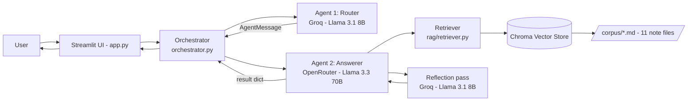
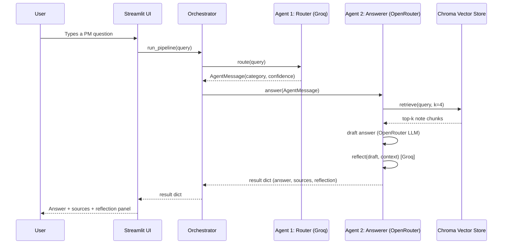

# 📘 Personal Study Assistant — Project Management

A multi-agent RAG study assistant grounded strictly in my own Project
Management module notes (Intro to PM, PM in the IT Context, Risk, HR,
Communication, Agile, Scope, Cost Management/EVM, Procurement, Project
Selection, and Time Management/CPM/PERT). Ask a question, and a **Router
agent** classifies it, hands a structured message to an **Answerer agent**,
which retrieves the relevant notes and generates a grounded answer with a
built-in self-critique step.

**Live demo:** _[add your Streamlit Community Cloud URL here after deployment]_
**Repo:** https://github.com/\<your-username\>/Personal-study-assistant-

---

## 1. Project Description

This assistant answers three kinds of PM study questions:
- **Concept explanations** ("why do IT projects fail more often than construction projects?")
- **Past-exam-style questions** ("given PV, EV, AC, BAC, calculate CPI and EAC")
- **Definition lookups** ("what is scope creep?")

It never answers from general knowledge alone — every answer is generated
strictly from retrieved chunks of my own notes, with a fallback message if
the notes don't contain the answer.

---

## 2. Architecture



**Orchestrator–worker pattern**: `orchestrator.py` is the single place that
calls both agents; the Router and Answerer never call each other directly.

---

## 3. Agentic Design Patterns (≥3 required)

| # | Pattern | Where implemented |
|---|---|---|
| 1 | **Router pattern** | `agents/router_agent.py` — classifies every question into `concept_explanation`, `past_exam_question`, or `definition_lookup` before any answering happens. |
| 2 | **RAG (retrieval-augmented generation) + tool-use** | `agents/answerer_agent.py` calls `rag/retriever.retrieve()` as an explicit tool *before* generation — the model is never allowed to answer from parametric memory alone. |
| 3 | **Reflection / self-critique** | `agents/answerer_agent.py::_reflect()` — after the draft answer is generated, a second lightweight model call checks whether the draft is actually supported by the retrieved context, and appends a caveat if not. |
| (bonus) | **Orchestrator–worker** | `orchestrator.py` coordinates Router and Answerer as independent workers, passing structured messages between them. |

---

## 4. Agent-to-Agent Communication

Two independent agents (Router, Answerer) exchange a structured JSON-style
message, defined in `agents/protocol.py` as a custom lightweight protocol
inspired by MCP/A2A-style message envelopes:

```json
{
  "from_agent": "router",
  "to_agent": "answerer",
  "intent": "route_response",
  "payload": {"query": "What is scope creep?", "category": "definition_lookup"},
  "confidence": 0.93,
  "message_id": "a1b2c3d4",
  "timestamp": 1753500000.0
}
```

### Sequence Diagram



---

## 5. Model Selection Strategy

Two providers, two distinct models, chosen deliberately per sub-task rather than using one model for everything:

| Sub-task | Model (provider) | Latency | Cost/token | Context window | Reasoning quality | Why chosen |
|---|---|---|---|---|---|---|
| Intent routing (3-way classification) | Llama 3.1 8B Instant (**Groq**) | Very low (Groq's LPU inference, typically <300ms) | Near-free | 128K | Low–moderate, sufficient | Classification into 3 labels is simple pattern-matching; paying for a large model's reasoning here would only add latency and cost with no accuracy benefit. |
| Answer synthesis (grounded RAG generation) | Llama 3.3 70B Instruct (**OpenRouter**) | Moderate (larger model, hosted inference) | Higher than Groq's 8B, still inexpensive per call | 128K (comfortably fits 4 retrieved chunks + question) | High — needed to correctly synthesize formulas, worked examples, and nuanced explanations strictly from context | The final answer is the one thing the user directly reads and evaluates; higher reasoning quality here is worth the extra cost/latency versus routing. |
| Reflection / self-critique (grounded-or-not judgement) | Llama 3.1 8B Instant (**Groq**), reused | Very low | Near-free | 128K | Low–moderate, sufficient | Checking "is this draft supported by the given context" is close to a binary classification task, same reasoning as routing — no need to pay for a second expensive call just to sanity-check the first one. |

**Why not one model for everything?** Using the 70B model for routing and
reflection would roughly triple the number of expensive calls per question
for no accuracy gain on tasks that are essentially classification. Using
the 8B model for final answer synthesis would risk shallower, less
reliable grounded explanations — especially for the EVM/CPM numeric
questions, which need careful multi-step formula reasoning.

---

## 6. RAG Pipeline

**Corpus**: 11 original markdown notes files under `corpus/`, one per PM
topic area (see list in Section 1), written from scratch (not copied from
any textbook) — roughly 6,100 words total.

**Chunking strategy** (`rag/ingest.py`):
1. Each file is split on `## ` markdown headers, so a chunk never crosses
   a topic boundary mid-section.
2. Within a section, if the section exceeds 180 words, a **sliding window**
   (180 words, 40-word overlap) further splits it so no formula or fact is
   cut exactly at a boundary.
3. Every chunk is prefixed with `[filename | section heading]` before
   embedding — this lets the embedding capture topic + content together,
   which measurably improves retrieval precision for short queries.
4. Result: **84 chunks** from 11 files.

**Embedding model**: `sentence-transformers/all-MiniLM-L6-v2` — free, runs
locally (no per-query API cost or extra latency for embeddings), 384-dim,
fast enough to embed the whole corpus in seconds on CPU (important for
Streamlit Community Cloud's free-tier compute).

**Vector store**: **Chroma** (`PersistentClient`, local directory
`chroma_db/`, excluded from git and rebuilt automatically from `corpus/`
on first run) — zero cost, no external account needed, appropriate for a
single-user demo app.

**Retrieval evaluation**: see [`eval/retrieval_eval.md`](eval/retrieval_eval.md)
for 5 sample queries run against the retriever with commentary on whether
the correct section was retrieved.

---

## 7. Setup Instructions

```bash
git clone https://github.com/<your-username>/Personal-study-assistant-.git
cd Personal-study-assistant-
python -m venv venv
source venv/bin/activate       # Windows: venv\Scripts\activate
pip install -r requirements.txt

# Local secrets (never committed - see .gitignore)
cp .streamlit/secrets.toml.example .streamlit/secrets.toml
# then edit .streamlit/secrets.toml and paste your real GROQ_API_KEY and OPENROUTER_API_KEY

streamlit run app.py
```

### Deploying to Streamlit Community Cloud
1. Push this repo to GitHub (public, or private with the lecturer added as a collaborator).
2. Go to [share.streamlit.io](https://share.streamlit.io), connect the repo, set the entry point to `app.py`.
3. Under **App settings → Secrets**, paste:
   ```toml
   GROQ_API_KEY = "..."
   OPENROUTER_API_KEY = "..."
   ```
4. Deploy. The Chroma vector store is built automatically from `corpus/*.md` on first run.

---

## 8. Secrets Management

- API keys are read only via `st.secrets` (Streamlit Cloud) or environment
  variables — never hardcoded anywhere in source.
- `.gitignore` excludes `.streamlit/secrets.toml`, `.env`, and the
  generated `chroma_db/` directory.
- `.streamlit/secrets.toml.example` documents the expected format without
  containing real keys.

---

## 9. Known Limitations

- The corpus is limited to one module (Project Management); questions
  outside these 11 topic areas will correctly get a "not found in notes"
  style response rather than a hallucinated answer.
- Router classification occasionally misclassifies borderline questions
  (e.g. a definition phrased as "explain what X means" could go either
  way) — the reflection step does not currently correct routing mistakes,
  only answer-grounding mistakes.
- Chroma's local persistence means the vector store rebuilds from scratch
  on Streamlit Cloud's cold starts if the underlying container is recycled
  (a few seconds' delay, not a correctness issue).
- No conversation memory across turns — each question is answered
  independently.

---

## 10. Repo/Branching Practice

- `main` — final merged, working version.
- `feature/rag-pipeline` — corpus, chunking, embeddings, Chroma store.
- `feature/agent-orchestration` — Router agent, Answerer agent, protocol, orchestrator, reflection step.
- `feature/streamlit-ui` — `app.py`, error handling, sidebar.
- `feature/model-router` — model selection tuning, comparison table, README docs.

Each merged via a Pull Request with a descriptive title. Commit messages
follow semantic conventions (`feat:`, `fix:`, `docs:`, `refactor:`, `test:`).
